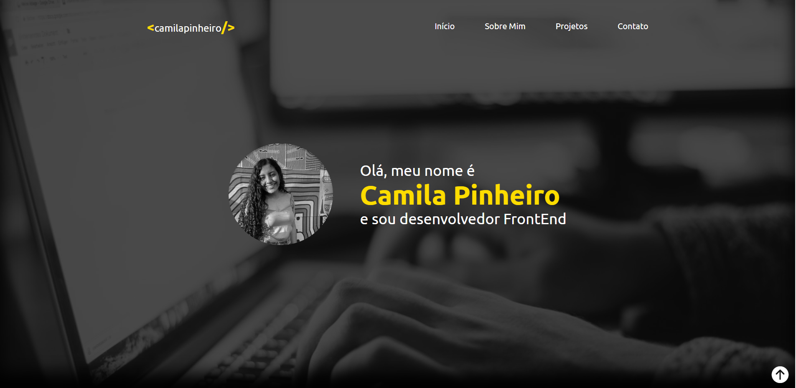

# portifolio

[Clique aqui](https://camilapinh3iro.github.io/portifolio/) para acessar o site 

---
## Sobre 
Site do tipo lading page para divulgar o meu portifólio.

O objetivo deste projeto é colocar em prática os conhecimentos adquiridos no curso do [SENAI Jandira](https://camilapinh3iro.github.io/killjoy/) na criação de web sites.    

---
## Tecnologias utilizadas 
- HTML
- CSS
- Markdown
- Responsividade

---
## Autor 
- [Camila Pinheiro](https://github.com/camilapinh3iro)